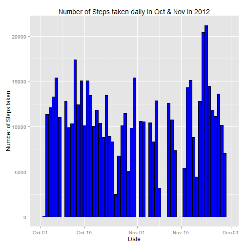
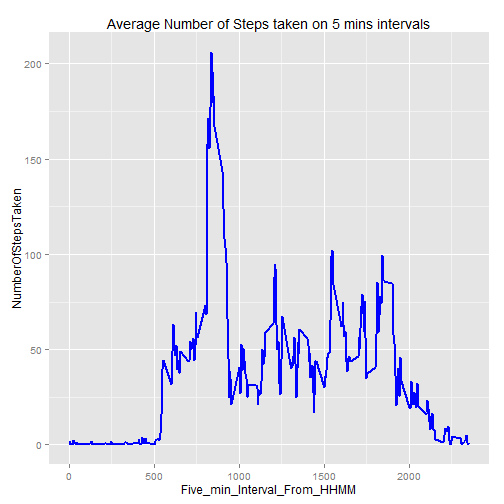
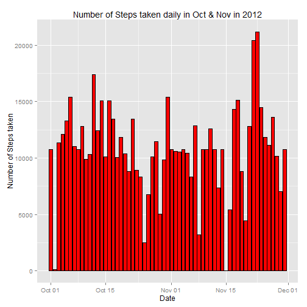
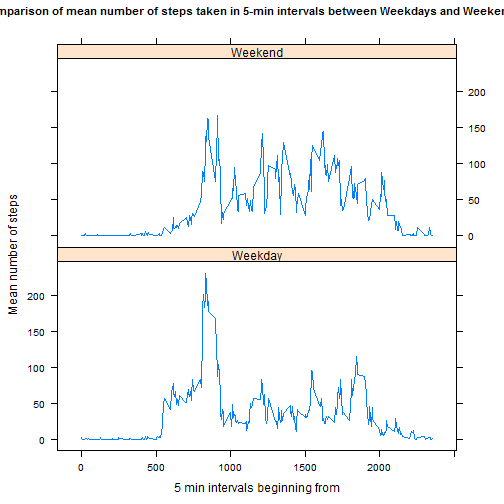

This is a report for Reproducible research peer assessment 1.
It seeks to answer questions on data containing number of steps taken in 5 minute intervals over the months of Oct and Nov in 2012.

First we load the plotting packages and the data file:

```r
library(ggplot2)
library(lattice)
setwd("C:/Users/loocw/Desktop/Coursera")
activity <- read.csv("activity.csv", header = TRUE)
```
        
# What is the mean total number of steps taken per day?

Summarising the data file, we have:

```r
Stepsbyday <- aggregate(activity$steps, by = list(activity$date), FUN = sum)
colnames(Stepsbyday) <- c("Date", "NumberOfStepsTaken")
Stepsbyday[,1] <- as.Date(Stepsbyday[,1], format = "%Y-%m-%d")
```
    
Next we plot the daily mean number of steps taken on a histogram:

```r
g <- ggplot(Stepsbyday, aes(x=Date, y=NumberOfStepsTaken))
g + geom_bar(fill="blue",color="black", stat="identity", position = position_dodge()) + labs(title = "Number of Steps taken daily in Oct & Nov in 2012", y = "Number of Steps taken")
```

 

We then calculate the daily mean and median number of steps taken:

```r
mean(Stepsbyday[,2], na.rm = TRUE)
```

```
## [1] 10766.19
```

```r
median(Stepsbyday[,2], na.rm = TRUE)
```

```
## [1] 10765
```

# What is the average daily activity pattern
        
We first summarise the data file:        

```r
Stepsbyinterval <- aggregate(activity$steps, by = list(activity$interval), FUN = mean, na.rm=TRUE)
colnames(Stepsbyinterval) <- c("Five_min_Interval_From_HHMM", "NumberOfStepsTaken")
```
        
Next we create a time series plot of the 5-min interval and average number of steps taken:

```r
g1 <- ggplot(Stepsbyinterval, aes(x=Five_min_Interval_From_HHMM, y=NumberOfStepsTaken))
g1 + geom_line(colour="blue", size = 1) + labs(title = "Average Number of Steps taken on 5 mins intervals")
```

 

Next we want to find out the 5 min interval that contains the highest number of steps on average:

```r
rownumbermaxsteps <- which(Stepsbyinterval[,2]==max(Stepsbyinterval[,2]))
Stepsbyinterval[rownumbermaxsteps,1]
```

```
## [1] 835
```
Hence the interval is from 0835 to 0840.

# Imputing missing values

We first try to calculate the total number of missing values in the dataset.

```r
sum(is.na(activity[,1]))
```

```
## [1] 2304
```

```r
sum(is.na(activity[,2]))
```

```
## [1] 0
```

```r
sum(is.na(activity[,3]))
```

```
## [1] 0
```
Hence we can report that the total number of missing values in the entire data set is 2304, and they all occur on the first column (data-entry).

We then fill up the missing values by filling it up with the mean of the corresponding interval.

We first create a new data frame, and then fill it the gaps with a for-loop.

```r
activitynew <- data.frame(activity)
for(i in (1:nrow(activitynew))){
                        if(is.na(activitynew[i,1])){
                            activitynew[i,1]<- mean(activitynew[,1][activitynew$interval == activitynew[i,3]], na.rm=TRUE)
                                }}
```

We then summarise the data and plot the new data onto a histogram:

```r
newStepsbyday <- aggregate(activitynew$steps, by = list(activitynew$date), FUN = sum)
colnames(newStepsbyday) <- c("Date", "NumberOfStepsTaken")
newStepsbyday[,1] <- as.Date(newStepsbyday[,1], format = "%Y-%m-%d")

g <- ggplot(newStepsbyday, aes(x=Date, y=NumberOfStepsTaken))
g + geom_bar(fill="red",color="black", stat="identity", position = position_dodge()) + labs(title = "Number of Steps taken daily in Oct & Nov in 2012", y = "Number of Steps taken")
```

 

We then calculate the new mean and median:

```r
newmeanstepsperday <- mean(newStepsbyday[,2], na.rm = TRUE)
newmedianstepsperday <- median(newStepsbyday[,2], na.rm = TRUE)
```

We can see that there has been no change in the mean, whereas there's a slight (but insignificant) change in the median.

The impact of filling in the missing values is nil for mean and it shifts the median slightly because we filled in the blanks with the interval mean values. 

#Are there difference in activity patterns between weekdays and weekends?

Next We wish to investigate whether there are any differences in activity levels between weekdays and weekends.

We first add in a column indicate the day of the week and then assign a new column to indicate weekday/weekend.


```r
activitynew[,2] <- as.Date(activitynew[,2], format = "%Y-%m-%d")
activitynew["Day"] <- weekdays(activitynew[,2])
                

for(i in (1:nrow(activitynew))){
    if(activitynew[i,4]=="Saturday"|activitynew[i,4]== "Sunday"){
        activitynew[i,5] <- "Weekend"    
            }else{activitynew[i,5] <- "Weekday"
                }}

activitynew[,5] <- as.factor(activitynew[,5])
```

Next we summarise the data accordingly:

```r
Stepsbydaybyinterval <- aggregate(activitynew$steps, by = list(activitynew$interval,activitynew[,5]), FUN = mean, na.rm=TRUE)
colnames(Stepsbydaybyinterval) <- c("Interval","WeekdayWeekend", "Mean_number_of_steps")
```

Finally we do a time series panel plot comparing the average number of steps taken over 5 min intervals between weekdays and weekends.

```r
xyplot(Mean_number_of_steps ~ Interval | WeekdayWeekend, data = Stepsbydaybyinterval, layout = c(1, 2), type="l", xlab= "5 min intervals beginning from", ylab = "Mean number of steps", main =list("Comparison of mean number of steps taken in 5-min intervals between Weekdays and Weekends", cex=0.9))
```

 

So can we observe that the trends in activity level (number of steps taken) is the same for weekdays and weekends. However, weekdays do exhibit higher peaks, possibly due to preparing to go/get off work in the mornings/evenings.
    
